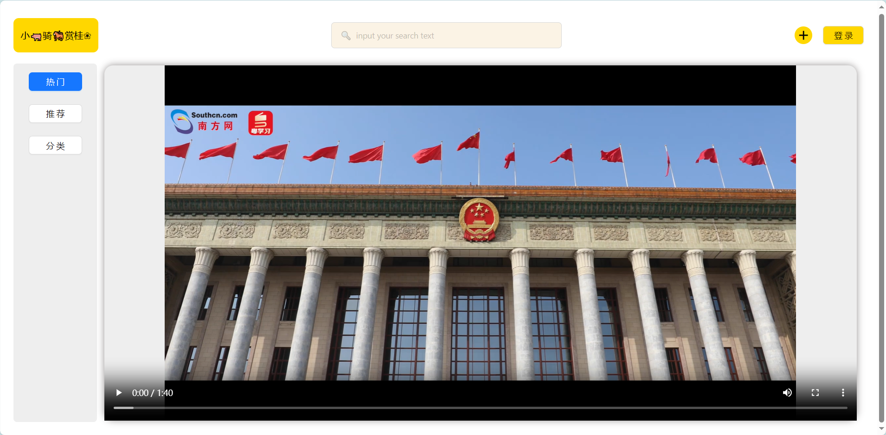
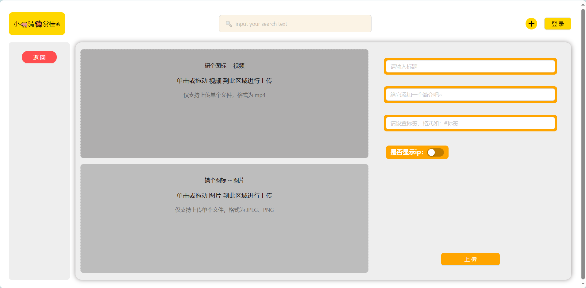
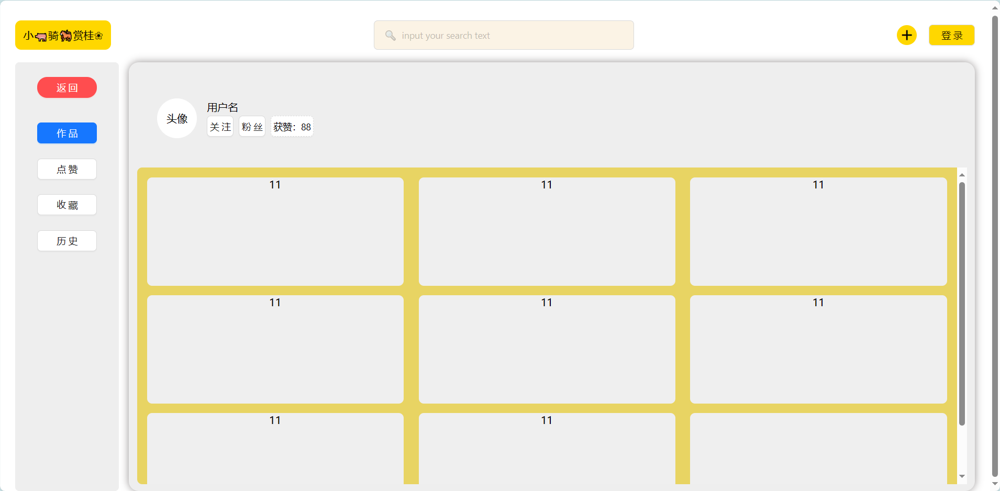

# ShortVideo

## 布局思考
1. 顶部设计一个组件，包含 Logo、搜索、发布作品、登录、用户信息 。这个组件在全局都不变的
2. 下方设计是左右布局，这个布局比例基本也不会变化。所以弄一个容器组件，左侧是列表，放一些按钮，右侧是 一个大方块，放视频或个人中心、上传控件等
3. 左侧可以放一些组件，右侧也是放一些组件。比较难的就是 数据流向 方面的了，之后再去思考这个。

## 导入库
1. ant-design-vue
   1. 本来想 局部引入的，但不知道为什么 除了 button 都用不了，官网也没有类似 element 的很好的引入方式，也不知道是不是引入错了
   2. 所以先全局引入，最后再看看怎么优化（tree-shaking 或者 局部引入）
2. less、less-loader

## 细节
1. 在开发播放控件的时候，要注意视频的获取在生命周期和视频资源加载完的不同钩子的调用。例如想获取 音量 等，就得在 mounted 中，但想要获取视频长度，就得等到视频加载完，并不是挂载了组件就能获取到的。
2. 音量设置、进度条设置这些用 移动进度条 完成，并且有一个 change 事件作为 钩子去改变视频对应的值，注意音量的范围是 0-1
3. 时间的格式化,涉及到时间戳有小数点.一开始是在 秒 的时候向下取整,后来发现可以将时间戳 取整 再转化格式,这个技巧不错
4. 如何保证视频在播放时动态获取当前的播放进度并且赋值呢?
5. 开发完基础的视频控件和音量那些后,发现还有 全屏--点赞 等很多要做的,但是当前代码已经 300 行了,再写就是屎山了
   1. 于是就思考这样的代码怎么样才能抽离呢?一开始以为抽离不了,但是后面发现实际上这么多的方法,都是依赖于一个 video,那我写一个 hooks,接受 video 参数,内部做处理返回需要的数据是否就ok了?
   2. 然后抽离成 hooks 后,顿悟了 hooks 和 tools 的区别,并且成功的迁移了所有的逻辑到 hooks 中,只对外暴露方法和响应式数据!太酷了,vue3真的好用,直接将逻辑给向外抽离出来了!
6. 快进和快退的方法，需要传入一个参数进行表示。但静音的方法，内部维护一个 flag 控制是否静音，就不需要传入参数了，这个细节还挺不错的

## 开发计划
> 已完成 && 细节
* [x] 项目创建 - vue3、eslint、prettier、andtV、Less
* [x] 基础布局 - 组件划分、路由建设
* [x] 首页基础布局完成，剩余以下细分任务未完成
  
* [x] 完善组件 - 顶部、左侧、右侧 静态页面
  * [ ] 视频切换核心功能以及 点赞、收藏等图标
* [x] 其他页面的继续开发 -- 基本的页面完成了，剩余小细节
* [x] 引入了 icon 图标，能正常使用了，需要引入组件
  * [ ] 但是 input 那些上面的 icon 不知道为什么还是有bug一样不展示
* [ ] 这个音量每次加载默认都是 1,看看是怎么回事能不能调整一下 

---
> 下一步计划
* [ ] 明天可以先对接文件上传相关的业务了，其他时间一边继续完善组件的开发，有得对接就先对接
* [ ] 视频考虑自定义控件以及功能实现
> 操作
  * [x] 单击暂停，同时暂停时在视频中间显示 图标 以及进度条、快进
  * [x] 暂停时再单击为播放，视频中间一闪而过的图标，进度条等隐藏
  * [x] 键盘控件用 单击空格 表示鼠标单击
  * [ ] 双击点赞，空格同理，取消赞也是双击，同样在屏幕中间一闪而过
  * [x] 右键：单击快进10s，长按为 2倍速 播放
  * [x] 左键：单击快退10s，长按为等比例倒退进度条（可以暂时不做长按先）
  * [ ] 上下键：切换视频
> 样式
  * [x] 静音键排列在右下角，与全屏放在一起。点击静音或者按 M 控制静音
  * [x] 静音的左侧放 倍速选择 ,点击 声音图标 设置 mute
  * [x] 中间下面放 播放暂停、快进快退的样式
  * [x] 还得放一个倍速播放选择器
  * [x] 全屏按钮功能后续再完善
  * [x] 控件上方放细细的进度条，进度条上方有小小的 视频作者以及简介+标签
  * [x] 右侧有 点赞、收藏、作者头像和主页
  * [ ] 左上角悬挂一个操作提示：有关于键盘操作以及鼠标操作的。可以让用户点击隐藏或不再提示（细节优化）

---
> 留下的坑
* [ ] 个人中心的视频列表，可能需要使用算法进行展示。或者想办法优化 css 和 html 结构 也行
* [ ] 左侧按钮切换
* [ ] 分类页面
* [x] 视频的样式还比较 low ，看看怎么重新设计（导库或自制）
* [ ] 视频的全屏用得是默认的播放器，暂停和播放还有bug冲突
* [ ] 长按的键盘事件倍速未完成，卡在了和 单击事件 区分这个环节

---
> 后期处理（迭代版本）
* [ ] 用户体验优化
* [x] 上传视频按钮交互效果
* [ ] 每个视频背景蒙版是以 原视频 的第一帧为背景+毛玻璃实现，给后面优化一下

> 进度逆推
* 1 号完成视频的控件样式以及基础的快进等操作
* 2 号对接完视频的播放以及视频核心功能，上下键切换视频，点赞和收藏、关注等与后端有交互的，基本实现 视频模块
* 3 号完成文件上传，图片上传、搜索 功能
* 4 号完成个人中心的收藏、关注、粉丝、个人中心视频的分类等
* 5 号完成登录鉴权验证等，与用户关联起来，关注等，整体走一遍测试，目标是完整真正能发布的短视频项目
* 6 号进行优化完善、文档编写
* 7 号完全收尾，进行项目材料准备，任务说明书、需求说明书等。完善项目