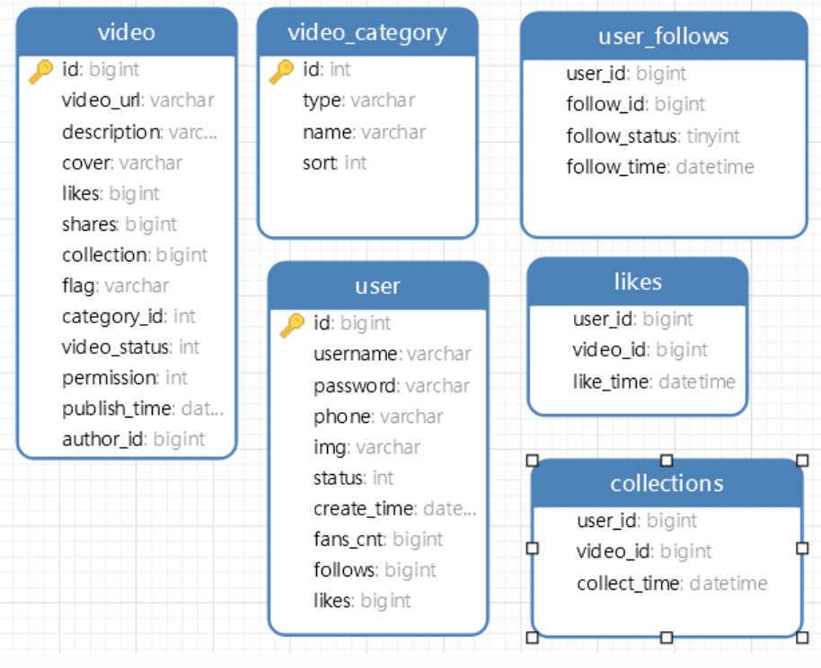

# ShortVideo -- front

> 小猪骑马赏桂花

## 前端项目运行方式

1. 将本仓库中前端分支的代码克隆到本地
2. 在终端运行  `npm install`
3. 安装完依赖后，运行： `npm run dev` 
4. 之后便能看到项目在本地运行，点击即可在浏览器预览

> 使用已部署的 `http://47.120.44.145:9999/` 进行访问

## 项目框架

```Bash
src 下目录结构
├─assets # 静态文件
├─components # 个人组件库
│  ├─layout # 布局组件
|  │  ├─Content
│  │  └─Header
│  ├─GhDialog # 弹窗组件
│  ├─GhVideo # 视频组件
│  └─GhVideoControls # 视频的控制组件
├─hooks # 前端 hooks
│  ├─controls
│  ├─form 
│  └─upload
├─router # 前端路由
│  └─index
└─stores # 前端仓库
|   └─bussiness # 业务仓库
├─tools # 常用工具
│  ├─formatTime
│  ├─axios
│  └─request
|─views # 前端页面
|   ├─HomeView # 首页
|   ├─PersonViiiew # 个人中心页面
|   └─UploadView # 上传页面
```

* 使用的技术说明

**Vue3+Vite+Pinia+Vue-router：**使用 vue3 的生态实现 Web 单页面开发，与后端通过 接口 进行交互。

**Antd-V：**选择 antd-v 作为UI组件库，是因为完成本项目组件比较基础，elm、vant 这些 的也比较多就想换一个体验一下，为下一步学习 react 打基础。

**Eslint+Prettier：**使用熟悉的这两个库进行代码格式校验以及格式化，为后续维护扩展奠定基础。

**Less+Axios+QS：**使用 Less 预处理器提高 css 编写效率。 Axios 和 QS 为接口交互提供服务。

## 后端

####  开发环境

| 工具  | 版本或描述           |
| ----- | -------------------- |
| OS    | Windows 10           |
| JDK   | 1.8+                 |
| IDE   | IntelliJ IDEA 2020.3 |
| Maven | 3.6.1                |
| MySQL | 8.0.26               |


#### SQL Model



#### 使用说明

1. 使用IDE导入本项目

2. 新建数据库`CREATE DATABASE shortvideo;`

3. 导入数据库`sql/shortvideo(1).sql`

4. 修改(

   ```
   resources/application-zzs.yml
   ```

   )配置文件

   1. 数据库链接属性(可搜索`datasource`或定位到L.5)

5. 运行项目(三种方式)

   1. 项目根目录下执行`mvn -X clean package -Dmaven.test.skip=true`编译打包，然后执行`java -jar backend/target/ShortVideo.jar`
   2. 项目根目录下执行`mvn springboot:run`
   3. 直接运行`BackendApplication.java`

6. 浏览器访问`http://127.0.0.1:8080`


##  Demo 演示视频

[演示视频](./teamDoc/teamVideo.avi)